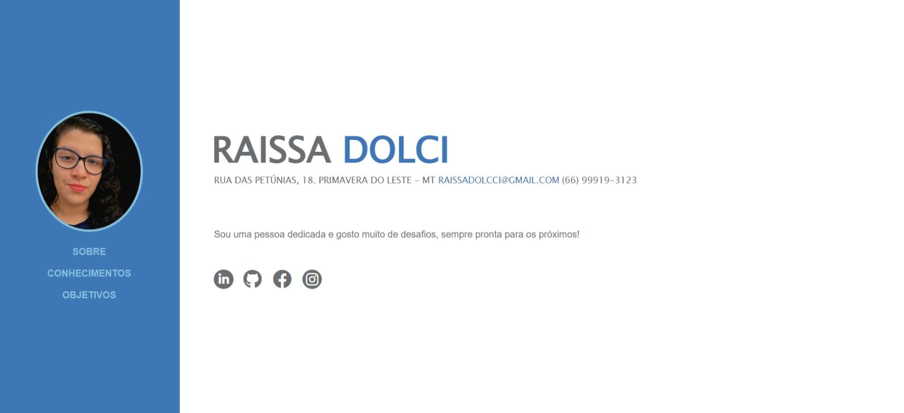

<h2>Atividade-Final-Front-End-I</h2>

 Atividade Final de Módulo de Font-End I, proposta pela escola de formação Growdev no curso de Desenvolvedor Web Full Stack. 

 A atividade consiste na criação de um currículo digital utilizando apenas HTML e CSS, sendo uma página inicial com as informações pessoais, uma página 
    conhecimentos e por fim, uma página sobre objetivos pessoais e profissionais, seguindo como base um modelo disponibilizado pelo curso!

    

 Veja abaixo o preview da primeira tela do projeto: 

    
 
 
 
 Projeto e testes feito em uma <strong>tela de 15.6"</strong>, não foi solicitado responsividade no momento! 

